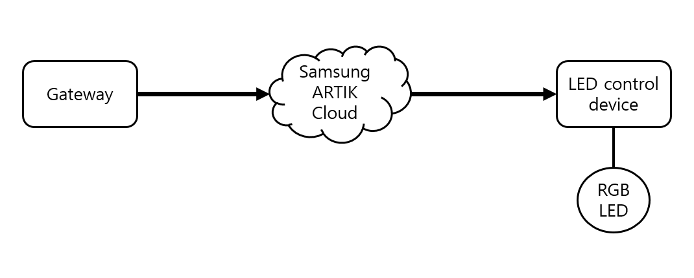

# artik_cloud_python
python source code in gateway for using ARTIK cloud

## Requirements
* Gateway : ARTIK 710
* LED device : ARTIK 530 + RGB LED 전구
* artik cloud sdk
* python 2.7

## Process

  

## 실행방법
### Gateway
    python iotGateway.py

### LED device 
    python sub_Cloud.py
